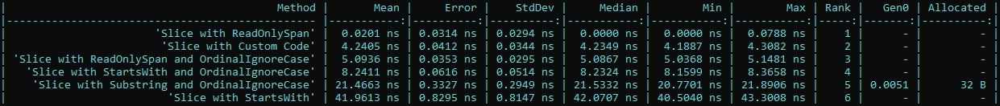

# Introduction to `Span<T>`
Provides a safe and efficient way to work with contiguous regions of memory

## What is `Span<T>`?
A Span<T> is a lightweight view over a contiguous region of memory that 
can be used to read from or write to that memory. It is similar to an 
array, but unlike an array, it does not own the memory it points to. 
Instead, it's just a reference to a contiguous region of memory that's 
already been allocated, and it allows you to work with that memory directly.

Span<T> is part of a family of types in C# called "memory types", which also 
includes Memory<T>, ReadOnlyMemory<T>, MemoryManager<T>, and others. These 
types are designed to provide efficient and safe ways to work with memory in C#.

## How does `Span<T>` work?
A `Span<T>` - which is a [ref struct](https://learn.microsoft.com/en-us/dotnet/csharp/language-reference/builtin-types/ref-struct) - contains a pointer to the start of the memory region, 
as well as a length that indicates the number of elements in the memory region.

The `Span<T>` struct also provides methods and operators that allow you to work with 
the memory region.

One of the advantages of using `Span<T>` is that it avoids unnecessary copying of memory. 
When you create a `Span<T>` object, you're just creating a lightweight view over the memory 
region - you're not creating a new copy of the memory. This makes `Span<T>` a great choice 
for performance-critical scenarios where you need to avoid unnecessary memory allocations 
and copying.

## Examples
Here are some examples of how to use `Span<T>` in C#:

### Example 1: Modifying an array in-place

```csharp
int[] numbers = { 1, 2, 3, 4, 5 };

Span<int> span = numbers.AsSpan();

span[2] = 42;

// Output: "1, 2, 42, 4, 5"
Console.WriteLine(string.Join(", ", numbers));
```

In this example, we first define an array of integers numbers with the values `{ 1, 2, 3, 4, 5 }`. 
We then create a `Span<int>` object span from the array using the AsSpan extension method.

We can then use the indexer syntax to modify the value of the third element (span[2]) to 42. 
This modifies the underlying array numbers directly.

Finally, we print the contents of the array to the console using the `string.Join` method.

The result is an array with the value { 1, 2, 42, 4, 5 }. Note that the `Span<int>` object span 
allows us to modify the contents of the array directly, without creating a new array or copying 
its contents.

### Example 2: Copying a substring to a new array

```csharp
string originalString = "Hello, world!";

Span<char> span = originalString.AsSpan();
Span<char> subSpan = span.Slice(0, 5);

char[] newArray = subSpan.ToArray();

Console.WriteLine(new string(newArray)); // Output: "Hello"
```

In this example, we first define a string originalString with the value "Hello, world!". 
We then create a `Span<char>` object span from the string using the AsSpan extension method.

We can then create a new `Span<char>` object subSpan that represents a substring of the original 
string, starting at index 0 and with a length of 5. We can then create a new `char[]` array 
newArray from the subSpan using the ToArray method.

Finally, we create a new string from the newArray using the string constructor that takes 
a `char[]` parameter, and print it to the console.

The result is a new string with the value "Hello". Note that the `Span<char>` object subSpan 
allows us to work with a substring of the original string without creating a new string or 
copying its contents.

## Difference between `Span<T>` and `Memory<T>`

The main difference between `Span<T>` and `Memory<T>` is that `Span<T>` does not own the memory 
it points to, while `Memory<T>` does. This means that when you create a `Span<T>` object, you're 
just creating a lightweight view over an existing memory region that's already been allocated. 
You're not creating a new copy of the memory, and you're not responsible for deallocating the 
memory when you're done with it.

In contrast, when you create a `Memory<T>` object, you're creating a new memory region that's 
owned by the `Memory<T>` object. This means that you're responsible for deallocating the memory 
when you're done with it.

## Conclusion

`Span<T>` is a powerful and efficient tool for working with contiguous regions of memory in C#. 
It allows you to work with memory directly, without unnecessary copying or memory allocations. 
By using `Span<T>`, you can write more performant and efficient code in C#.

---
## Benchmark Summary

The `PerfTest.cs` file contains all the methods used in the benchmark test.


---
## Links
- [Learn/.NET/API browser/System/`Span<T>` Struct](https://learn.microsoft.com/en-us/dotnet/api/system.span-1?view=net-7.0)

